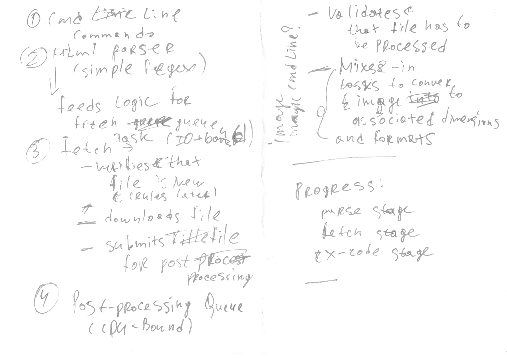

# crawler-java
Simple web page crawler that fetches images specified on a page and then does some transformations

## How to run ?
1. Execute mvn package
1. Run
```
java -jar target/crawler-java-<version>.jar -o /tmp/foo http://google.ie
```
   

Crawler's initial design here - 
